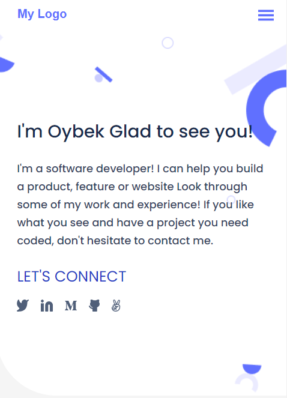

# portfolio-project

> Portfolio project in the Module-1 understand how to use a Figma design and use Flexbox to place elements in the page.

## Built With

- HTML
- CSS

## Getting Started

to set this project up please run these commands:

`git clone `

`cd `

## 👤 Author

- GitHub: [@OybekKayumov](https://github.com/OybekKayumov)
- Twitter: [@KayumovOybek](https://twitter.com/KayumovOybek)
- LinkedIn: [LinkedIn](https://www.linkedin.com/in/oybek-kayumov-54a8485b/)

## 🤝 Contributing

Contributions, issues, and feature requests are welcome!

Feel free to check the issues page.

# Show your support

Give a ⭐️ if you like this project!

## 📝 License

This project is [Microverse](https://www.microverse.org/) licensed.
